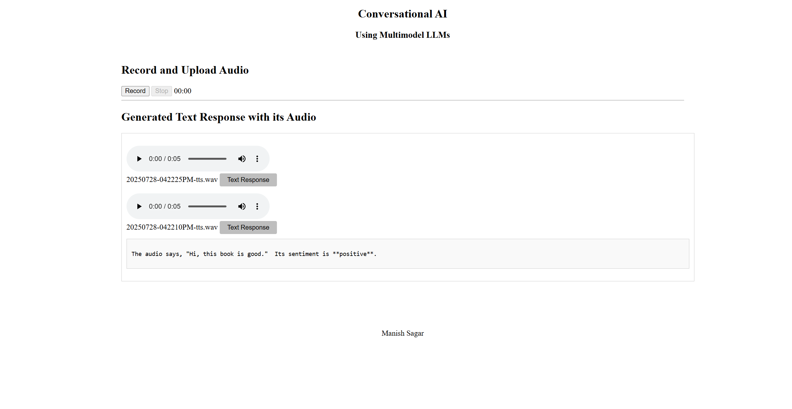

# Google-genai-audio-analyzer

The application leverages Google’s generative AI capabilities to create a seamless workflow for transcribing audio and performing sentiment analysis. By integrating multimodal LLMs and other cloud services, the app provides users with both textual and audio outputs for uploaded audio recordings. This project aims to streamline the process of interpreting audio inputs and extracting meaningful insights, improving accessibility and user interaction.

# Google GenAI Audio Analyzer

Web application for audio transcription and sentiment analysis using Google's Generative AI.



## Features

- **Audio Recording**: Web-based recorder with real-time timer
- **AI Transcription**: Speech-to-text using Google Gemini 1.5 Flash
- **Sentiment Analysis**: Emotion detection from spoken content
- **Text-to-Speech**: Convert results back to audio
- **File Management**: Automatic storage and playback of processed files

## How It Works

1. **Record**: Click record button, speak, then stop
2. **Process**: Audio sent to Gemini API for transcription and sentiment analysis
3. **View**: Click "Text Response" to see results
4. **Listen**: Play generated audio response

## Tech Stack

- **Frontend**: HTML, CSS, JavaScript
- **Backend**: Flask (Python 3.9)
- **APIs**: Google Gemini, Google Text-to-Speech
- **Deployment**: Docker, Google Cloud Run

## Quick Start

1. **Clone and install:**
```bash
git clone https://github.com/yourusername/google-genai-audio-analyzer.git
cd google-genai-audio-analyzer
pip install -r requirements.txt
```

2. **Set credentials:**
```bash
export GEMINI_API_KEY="your_api_key"
export GOOGLE_APPLICATION_CREDENTIALS="service_account.json"
```

3. **Run:**
```bash
python app.py
```

## Configuration

### Required APIs
- Google Generative AI (Gemini)
- Google Cloud Text-to-Speech

### Environment Variables
- `GEMINI_API_KEY`: API key from Google AI Studio
- `GOOGLE_APPLICATION_CREDENTIALS`: Path to service account JSON

## File Structure
```
├── app.py              # Main Flask app
├── templates/index.html # Frontend
├── script.js           # Client-side logic
├── requirements.txt    # Dependencies
├── Dockerfile         # Container config
└── service_account.json # Credentials (not in repo)
```

## Docker Deployment
```bash
docker build -t genai-audio-analyzer .
docker run -p 8080:8080 genai-audio-analyzer
```

## Use Cases
- Voice-to-text transcription
- Content sentiment analysis
- Accessibility tools
- Voice note processing

## Author
Manish Sagar
